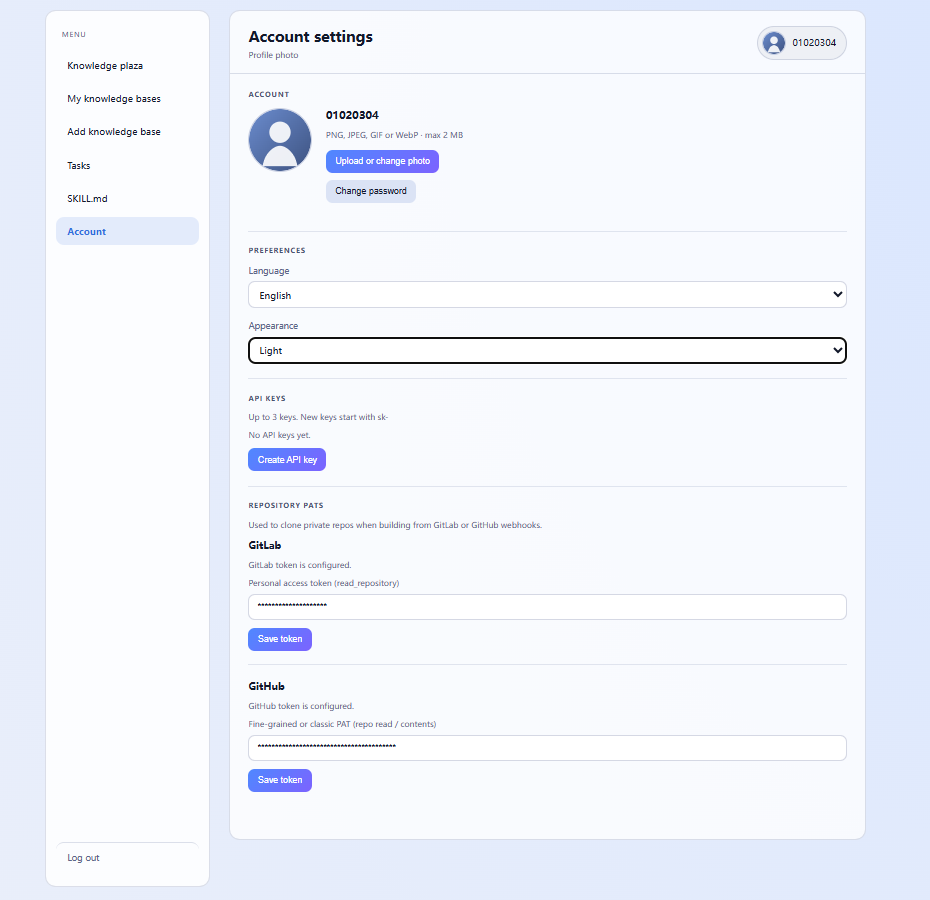
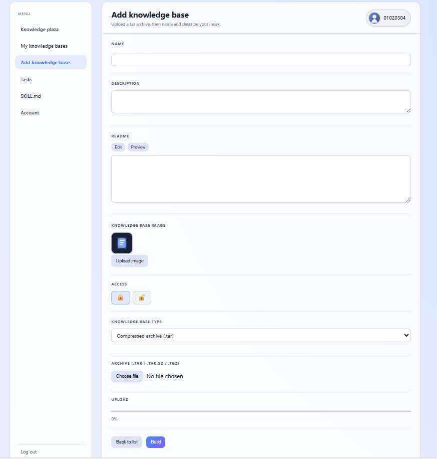
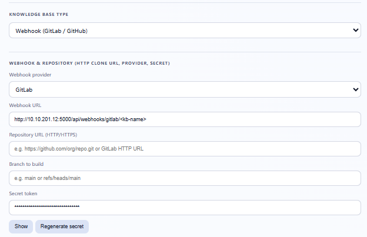
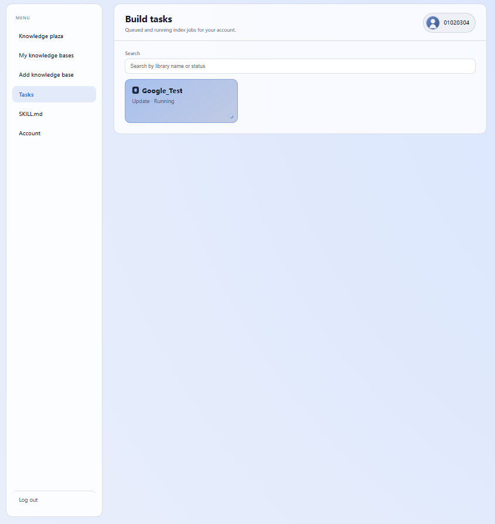
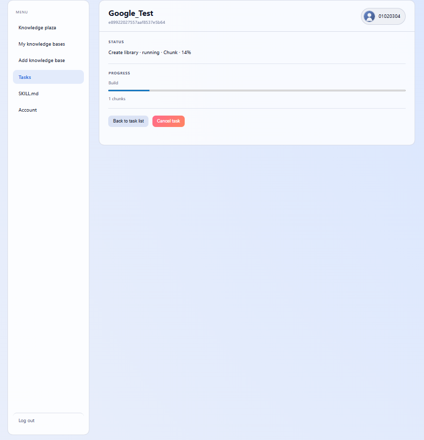
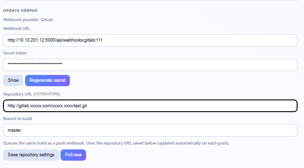

<h1 align="center" style="font-size: 2.75em; font-weight: 700; border-bottom: none;">RAGret</h1>

<p align="center">
  <a href="LICENSE"></a>
  <a href="https://www.python.org/downloads/"></a>
  <a href="https://www.docker.com/"></a>
  <a href="https://github.com/SugarSong404/RAGret"></a>
  <a href="https://github.com/SugarSong404/RAGret/pulls"></a>
</p>

<p align="center">English documentation · <a href="README.md">README.md</a></p>

## 什么是RAGret

`RAGret`(不是regret😂)是一套面向小型团队（15-30人），低成本服务器（显存<=8G）的自托管RAG Web应用。

使用`RAGret`时，团队成员可以发布知识库到广场，或订阅其他成员发布的知识库，并在其后通过GET请求方式查询知识库。

### 核心特点

- 知识库创建者可设置可见范围，灵活管控访问权限。
- **智能体**友好，应用提供**api-key**与**SKILL.md**，助力快速接入团队智能体工作流。
- 支持通过**tar 包上传**或**GitLab / GitHub 仓库 Webhook 触发**的方式接入，便于与团队现有文档存储习惯融合。飞书等在线文档支持也将陆续上线。
- 多种文件格式支持，**PDF(pdf),Word(docx),XLS(xlsx),Markdown(md),Email(eml),TXT(txt),CSV(csv),Web links(html)** 随意选择
- 支持中英文双语界面、亮/暗主题切换，以及通过 YAML 文件自定义品牌元素（如 favicon、页面标题）

### 技术选型

索引与检索管线使用 **BCE 向量模型 + SQLite 存储 + BCE 重排序**
依赖下方仓库与模型

- [BCEmbedding（GitHub）](https://github.com/netease-youdao/BCEmbedding)  
- [Hugging Face 上的模型](https://huggingface.co/maidalun1020)（`bce-embedding-base_v1`、`bce-reranker-base_v1`）

## 快速开始

在 **CUDA** 与 **Intel XPU** 中选一种 GPU 方案，在 **本机 Python** 与 **Docker** 中选一种运行方式；

**通用说明：**

- 同一环境只使用一种 GPU 栈和一种运行方式。
- **Hugging Face 镜像（可选）**：下载慢或被墙时，在运行 **`warmup_hf_models.py`** 或 **`docker build`** 前设置 **`HF_ENDPOINT`**（见下）。

```bash
# Windows PowerShell
$env:HF_ENDPOINT = "https://hf-mirror.com"

# Linux / macOS
export HF_ENDPOINT=https://hf-mirror.com
```

### 环境搭建

#### 本机 Python

1. **Python 3.10+**（已在 3.12 上测试），新建 venv 或 conda 环境。
2. **按 GPU 安装 PyTorch（二选一）：**
   - **NVIDIA CUDA**：参考 **[Start Locally](https://pytorch.org/get-started/locally/)**，或例如  
     `pip install torch torchvision --index-url https://download.pytorch.org/whl/cu124`
   - **Intel XPU**：参考 **[Intel GPU 入门](https://docs.pytorch.org/docs/stable/notes/get_start_xpu.html)**，安装 [Intel GPU 驱动](https://www.intel.com/content/www/us/en/developer/articles/tool/pytorch-prerequisites-for-intel-gpu.html) 后例如  
     `pip install torch torchvision torchaudio --index-url https://download.pytorch.org/whl/xpu`  
3. **应用依赖：** `pip install -r requirements.txt`
4. **模型（在索引/检索前做一次）**：在**仓库根目录**、联网执行：

   ```bash
   python warmup_hf_models.py
   ```

   权重会落到 **`./models`**。也可自行下载BCE权重复制到 **`./models`**

5.**校验GPU环境：**
    - CUDA：`python -c "import torch; print(torch.cuda.is_available())"` → `True`
    - XPU：`python -c "import torch; print(torch.xpu.is_available())"` → `True`
  在 **Intel XPU** 上，仅 **embedding** 走 GPU；因为上游仓库`BCEmbedding`的**rerank**不支持**XPU**。

---

#### Docker（仅 CUDA）

本仓库的 Docker 仅针对 **CUDA**（`Dockerfile`）。若使用 Intel XPU，请走上面的 **本机 Python**。

构建（构建阶段会把权重预热到镜像内的 **`/opt/hf`**）：

```bash
docker build -t ragret .
# 国内镜像，使用时请不要打开代理
docker build -t ragret --build-arg HF_ENDPOINT=https://hf-mirror.com .
```

运行需 **`--gpus all`**（或 `'--gpus "device=0"'`）。

```bash
docker run --name ragret -it --gpus all -p 8765:8765 ragret
```

### 启动服务

先前往`frontend`目录，运行

```bash
npm run build
```

在根目录下执行

```bash
python ragret.py serve --host 0.0.0.0 --port 8765
```

## 用户说明

### 偏好与凭证

前往 **账户** 界面：

1.可对头像、主题色与语言进行切换
2.您可以创建至多3个api-key，用于查询您创建或订阅的知识库
3.如果需要激活GitHub或GitLab的webhook功能，请在对应的位置填入您的PAT，为了安全起见，建议设置您的PAT权限为**仓库只读**

### 创建你的知识库

前往 **添加知识库**界面：

1.**必须**填入您的知识库名称与描述，这有助于智能体选择正确的知识库
2.选择性填入知识库描述文件（README）与知识库图片
3.设置您的知识库访问权限，选择上锁默认**仅创建者可见**，您可以在构建后向其中添加成员
4.选择知识库类型，**tar文件上传**不做赘述， **webhook模式**见下方图片

首次构建将从仓库直接拉取文件，所以填入仓库地址与分支是必要的
复制**Webhook URL**与**Secret Token**到对应仓库的Webhook创建部分进行添加
完成后点击构建按钮

### 查看进行中的任务

由于这是低成本服务器，所以文档切片与建库需要排队进行，每当点击构建或Webhook触发，都将注册为一个任务显示在任务列表
前往 **任务列表**界面：
您可以见到所有正在排队与运行中的任务

如有需要请随时取消它们


### 管理您的知识库

前往 **我的知识库**界面：
您可以见到所有您创建或订阅的知识库，点击您需要管理的知识库
大多功能不多赘述，有以下注意点：
1.如果是Webhook类型的知识库，在您变更知识库名称后请前往对应仓库修改Webhook链接
2.无论什么类型的知识库，重构建都是**基于变更**的，如果您需要以**tar类型**添加文件，应该添加**整个文档集**的压缩包
3.Webhook类型的知识库可以在该页面主动拉取仓库

4.您可以通过最下方的搜索功能直接测试知识库检索

### 使用知识库

1.在**知识库广场**界面对需要使用的知识库进行订阅
2.在**账户** 界面获取api-key
3.设置环境变量**RAGRET_API_KEY**

**GET请求:**

```bash
# 列出可用知识库
curl -sS -H "X-API-Key: $RAGRET_API_KEY" "$BASE/api/subscribe-indexes"
# 查询
curl -sS -G "$BASE/api/search/INDEX_NAME" -H "X-API-Key: $RAGRET_API_KEY" --data-urlencode "query=…"
```  

**导入Agent:**
下载SKILL.md，导入claude code, cursor, openclaw或一系列其他Agent

## TODO

1.支持更多文件格式，如表格，PPT，图片
2.支持飞书等在线文档的同步
3.支持分布式，面对高并发情景，扩大支持的团队规模
4.修复一系列不稳定的问题
